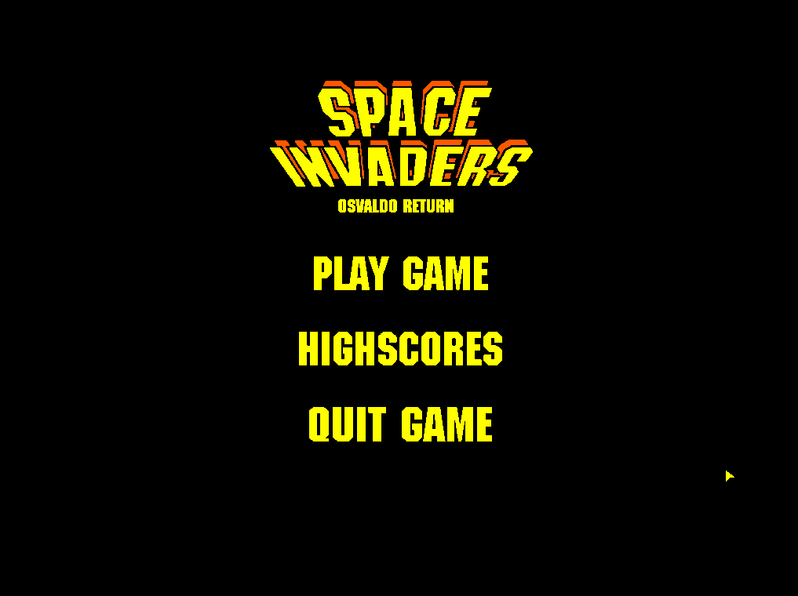
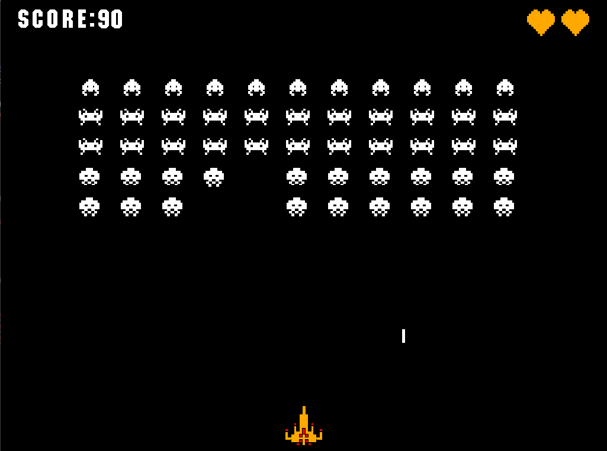

#  LCOM 2022/2023 
___

## Project - Space Invaders

Space Invaders is a classic arcade game set in the depths of outer space. The game takes place on a monochromatic terminal display in the Minix operating system. As the player, your mission is to defend the Earth from an onslaught of alien invaders descending from above.

The gameplay is simple yet addictive. Rows of alien invaders move steadily towards the bottom of the screen, approaching closer with each passing moment. Armed with a laser cannon at the bottom of the screen, you must eliminate the invaders before they reach the Earth's surface.

### Game Screenshots:
<table>
  <tr>
    <td></td>
    <td></td>
  </tr>
 </table>

___
### Running the Game
- Open the terminal on the diretory where Makefile is.
- Then proceed to run the command:```make clean ```
- Run the command : ``` make ```
- Once compiled, run the  just run the command:```lcom_run proj``
___

#### Work Done by Group T14-G05:
| Name | Email | 
|:-----------------:|:-----------------:|
| Adriano Machado | up202105352@fe.up.pt | 
|José João|up202108818@fe.up.pt|
| Luís Cunha | up201709375@up.pt | 
|Rodrigo Ribeiro |up202108679@fe.up.pt|

___

 
